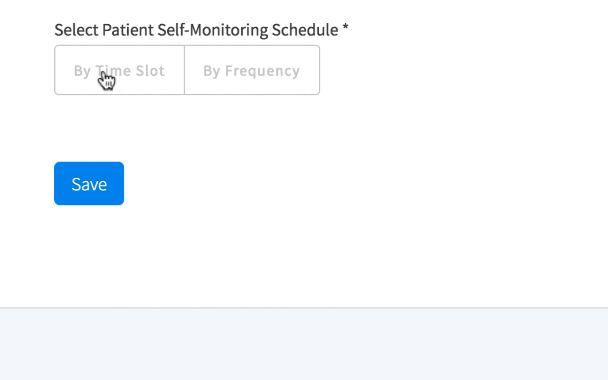

## HealthBeats frontend test

This project was bootstrapped with [Create React App](https://github.com/facebook/create-react-app).

## Requirement

- Finish a React (React - A JavaScript library for building user interfaces) component as per the gif shown below. 
- Please use ES2015 to complete this test. (GitHub - lukehoban es6features: Overview of ECMAScript 6 features)
- After click the save button, print selected value, please print the value under the component on the same page
- Add validation for input field and show error below the component after click the Save button
  - Do not allow to submit empty value
  - Input value:
  - Only allow enter Number
  - Value should > 0
- CSS requirements
  - Use FlexBox (flex - CSS | MDN) to do the layout
  - Put the component in the center of the page
  - Please send back the completed project with compressed file (zip, rar...)

## How to

   - Clone this project
   - Run `npm install`
   - Then `npm start`
   - Done